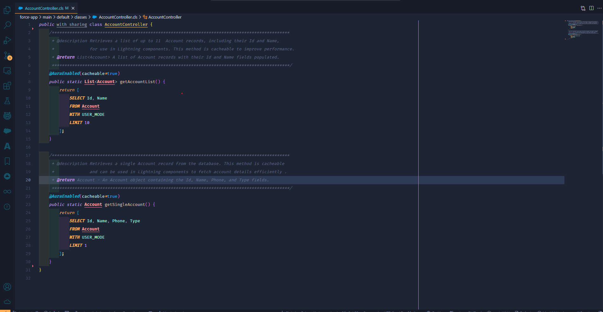
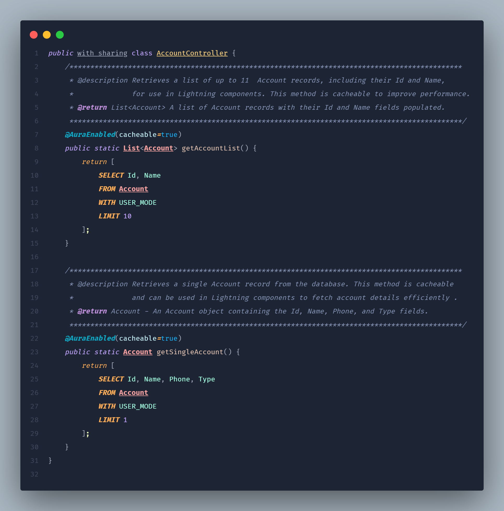

# Codey's Arbiter by Chan

 <!-- Placeholder for your extension icon -->

## Overview

Introducing **Codey's Arbiter by Chan**, a premium VS Code theme that elegantly combines the refined color palette of the Arbiter theme with the specific needs of Salesforce developers. This theme is crafted to provide a visually stunning and highly efficient coding environment, enhancing both aesthetics and productivity.

## Features

- **Arbiter-Inspired Palette**: Immerse yourself in the sophisticated and harmonious colors of the Arbiter theme, celebrated for their calming yet decisive tones.
- **Salesforce Optimization**: Benefit from enhanced syntax highlighting tailored for Apex, Visualforce, and Lightning Web Components, ensuring improved readability and focus.
- **Dark Mode Excellence**: Designed for developers who prefer a dark interface, this theme minimizes eye strain during prolonged coding sessions.

## Installation

1. Launch **Visual Studio Code**.
2. Access the **Extensions** view by clicking the Extensions icon in the Activity Bar or pressing `Ctrl+Shift+X`.
3. Search for `Codey's Arbiter by Chan`.
4. Click **Install** to seamlessly integrate the theme into your editor.
5. Navigate to **File > Preferences > Color Theme** and select **Codey's Arbiter by Chan**.

## Screenshots

 <!-- Placeholder for a screenshot of Apex code highlighting -->

 <!-- Placeholder for a screenshot of Salesforce development -->

## Why Choose Codey's Arbiter by Chan?

- **Salesforce-Centric Design**: Meticulously crafted for Salesforce developers, ensuring that critical elements in Apex, Visualforce, and LWC are highlighted with precision.
- **Enhanced Productivity**: The carefully curated color scheme helps maintain focus and productivity, making it easier to spot syntax errors and understand code structure.
- **Community-Driven Development**: We actively welcome feedback and contributions from the community to continuously refine and enhance the theme.

## Contributing

We welcome contributions! If you have suggestions for improvements or new features, please open an issue or submit a pull request. Ensure that your contributions align with the project's goals and coding standards.

## Feedback

We value your feedback on Codey's Arbiter by Chan. Feel free to reach out with your thoughts, questions, or ideas for future updates.

- **GitHub Issues**: [Submit Feedback](https://github.com/pelayochristian/codeys-arbiter-by-chan/issues)
- **Email**: pelayochristian.dev@gmail.com

## License

This project is licensed under the MIT License. See the [LICENSE](LICENSE) file for more details.

## Acknowledgments

Special thanks to the creators of the Arbiter theme for their inspiring color scheme and to the open-source community for their invaluable support.

---

Thank you for choosing Codey's Arbiter by Chan. We are confident it will significantly enhance your Salesforce development experience!